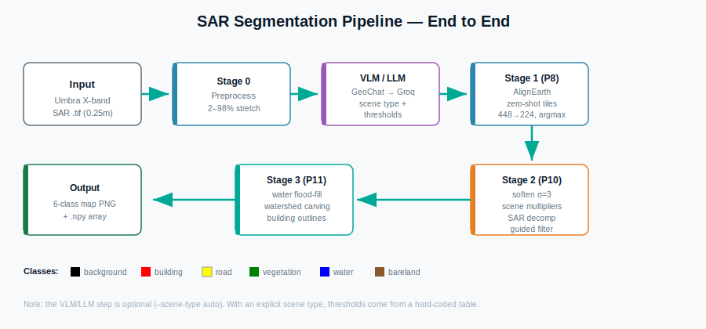
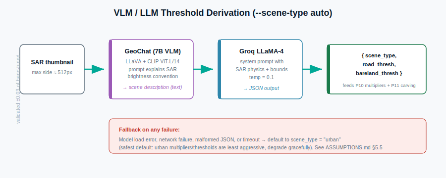
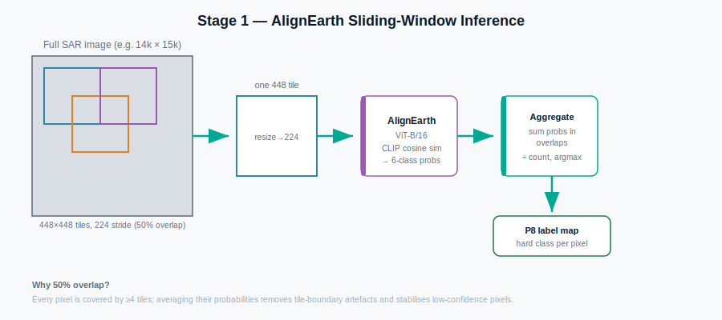
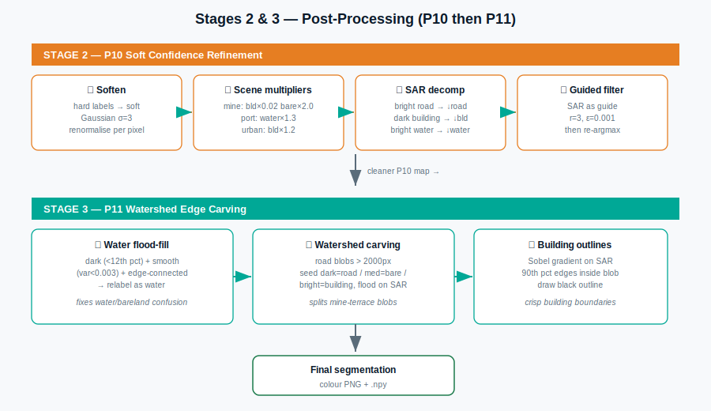

# SAR Semantic Segmentation — Full Pipeline Documentation

End-to-end documentation of the unsupervised SAR semantic segmentation
pipeline developed at DSO National Laboratories (Sensors Division), covering
every stage from preprocessing through the VLM/LLM threshold step to the final
post-processing.

The pipeline takes a single Umbra X-band SAR image and produces a six-class
land-cover segmentation map **without any ground-truth labels**.

**Classes:** `0 background · 1 building · 2 road · 3 vegetation · 4 water · 5 bareland`

---

## Table of Contents

1. [Overview](#1-overview)
2. [Stage 0 — Preprocessing](#2-stage-0--preprocessing)
3. [VLM / LLM Threshold Derivation](#3-vlm--llm-threshold-derivation)
4. [Stage 1 — AlignEarth Inference (P8)](#4-stage-1--alignearth-inference-p8)
5. [Stage 2 — P10 Soft Confidence Refinement](#5-stage-2--p10-soft-confidence-refinement)
6. [Stage 3 — P11 Watershed Edge Carving](#6-stage-3--p11-watershed-edge-carving)
7. [Output](#7-output)
8. [How to Run](#8-how-to-run)

---

## 1. Overview



The pipeline is a three-stage chain. A zero-shot vision-language model
(AlignEarth) produces an initial noisy labelling, then two classical
post-processing stages (P10, P11) correct that labelling using SAR backscatter
physics. An **optional** VLM/LLM step (GeoChat + Groq) replaces a hard-coded
threshold table when the scene type is not specified manually.

| Stage | Name | What it does | Learned? |
|-------|------|--------------|----------|
| 0 | Preprocess | Load + normalise SAR | No |
| (opt) | VLM/LLM | Derive scene type + thresholds | Pretrained, frozen |
| 1 | AlignEarth (P8) | Zero-shot pseudo-labels | Pretrained, frozen |
| 2 | P10 | Physics-aware refinement | No (rules) |
| 3 | P11 | Watershed edge carving | No (classical CV) |

---

## 2. Stage 0 — Preprocessing

Raw Umbra GeoTIFFs are 16-bit amplitude images with arbitrary intensity
ranges. Before any model sees the data we normalise each scene independently.

```python
def load_sar(tif_path):
    with rasterio.open(tif_path) as src:
        H, W = src.height, src.width
        sar = src.read(1).astype(np.float32)
    valid = sar > 0                                   # mask out zero-padding
    p2, p98 = np.percentile(sar[valid], 2), np.percentile(sar[valid], 98)
    sar_norm = np.clip((sar - p2) / (p98 - p2 + 1e-6), 0, 1)   # 2–98% stretch
    return sar_norm, valid, H, W
```

**What the code does, line by line:**

- `src.read(1)` — reads band 1 (SAR is single-channel amplitude).
- `valid = sar > 0` — Umbra scenes are zero-padded outside the imaged swath;
  this mask keeps real pixels only.
- `np.percentile(..., 2/98)` — finds the 2nd and 98th percentile of valid
  intensity. Clipping to these removes extreme bright/dark outliers (corner
  reflectors, noise) that would otherwise dominate the stretch.
- The final line rescales intensity to `[0, 1]`.

> **Assumption:** this stretch produces comparable brightness across scenes.
> See `ASSUMPTIONS.md` §1.

---

## 3. VLM / LLM Threshold Derivation

*(Only runs with `--scene-type auto`. With an explicit `mine|port|urban` the
pipeline skips this and reads the hard-coded threshold table.)*



This step decides the **scene type** and the two **brightness thresholds**
(`road_thresh`, `bareland_thresh`) that P10 and P11 depend on. It does so with
a two-model chain so that no human has to manually classify the scene.

### 3.1 GeoChat — vision → description

GeoChat (a 7B remote-sensing VLM) receives a downsampled thumbnail and a prompt
that **explicitly states the SAR brightness convention**, then returns a
natural-language description.

```python
prompt = DEFAULT_IMAGE_TOKEN + "\n" + (
    "A SAR (Synthetic Aperture Radar) satellite image. "
    "Bright areas = strong backscatter (buildings, rough surfaces). "
    "Dark areas = weak backscatter (water, smooth roads, shadow). "
    "Describe the scene: type, dominant land cover, water presence, "
    "building density, brightness patterns."
)
```

The brightness preamble is essential — without it GeoChat reasons about the
image as if it were an optical photo and produces unreliable descriptions.

### 3.2 Groq LLaMA-4 — description → JSON thresholds

The description is passed to Groq LLaMA-4 with a system prompt that gives the
SAR physics and **bounds the numeric output**, forcing a JSON response.

```python
system = (
    "You are an expert in SAR image analysis. ... "
    "roads=dark(0.05-0.20), bareland=medium(0.20-0.50), buildings=bright(0.40-0.80). "
    "Mine/arid: road_thresh LOW (0.10-0.13). Port/urban: slightly higher (0.14-0.17). "
    'Respond ONLY with JSON: '
    '{"scene_type":"<mine|port|urban>","road_thresh":<float>,"bareland_thresh":<float>}'
)
```

The response is parsed, clipped to safe ranges, and a sanity check ensures
`road_thresh < bareland_thresh`.

> **Network note:** Groq is called via `curl` subprocess (not `urllib`) because
> the development compute nodes blocked Python HTTP. See `ASSUMPTIONS.md` §5.6.

### 3.3 Fallback

If **anything** fails — model load, network, malformed JSON — the pipeline
falls back to `scene_type = "urban"` and prints a warning. Urban is the safest
default because its multipliers are the least aggressive. See `ASSUMPTIONS.md`
§5.5.

> **Validation:** across the 10 development scenes the VLM-derived thresholds
> were within **±0.03** of the hand-tuned values. This does not automatically
> transfer to new sensors/regions — re-validate.

---

## 4. Stage 1 — AlignEarth Inference (P8)



AlignEarth is a CLIP-based model distilled for SAR. It runs zero-shot — it has
never seen a labelled Umbra image. Because the full scene is far too large for
the GPU, inference uses an overlapping sliding window.

### 4.1 Tiling

```python
AE_TILE = 448      # tile extracted from full-res image
AE_STRIDE = 224    # 50% overlap
AE_INPUT = 224     # size fed to the model
```

- **448×448 tiles** are extracted, then resized to **224×224** (the ViT's
  native input). The 2× oversampling gives each model pixel more spatial
  context.
- **224 stride** → adjacent tiles overlap 50%, so every pixel is seen by ≥4
  tiles.

### 4.2 Per-tile forward pass + aggregation

```python
logits = model.forward_feature(tensor)                 # CLIP cosine-sim logits
logits_up = F.interpolate(logits.float(), size=(AE_TILE, AE_TILE),
                          mode="bilinear", align_corners=False)
probs = F.softmax(logits_up, dim=1).squeeze(0)         # 6-class probability map
...
prob_sum[:, y:y+AE_TILE, x:x+AE_TILE] += arr           # accumulate in overlaps
count_map[y:y+AE_TILE, x:x+AE_TILE] += 1
```

After all tiles: `prob_sum / count_map`, then `argmax` → the **P8 hard label
map**. Averaging probabilities across overlapping tiles removes tile-boundary
seams and stabilises low-confidence pixels.

> **Note on the `struct.pack` round-trip:** the development `geochat`/`segearth`
> environment had a numpy/torch ABI incompatibility. Serialising tensors to raw
> bytes and back to numpy bypasses the broken code path. On a clean environment
> this is a harmless no-op.

---

## 5. Stage 2 — P10 Soft Confidence Refinement


*(top half = P10, bottom half = P11)*

P10 takes the hard P8 labels and applies four sequential corrections grounded
in SAR physics.

### ① Soften

```python
for c in range(N_CLS):
    soft[c] = gaussian_filter((pred_raw == c).astype(np.float32), sigma=3)
s = soft.sum(0, keepdims=True); s[s == 0] = 1; soft /= s
```

Hard labels become soft probabilities so they can be adjusted multiplicatively.
Gaussian blur (σ=3) creates smooth class boundaries; the result is renormalised
to sum to 1 per pixel.

### ② Scene multipliers

```python
for cls_id, mult in conf_adj.items():
    if mult != 1.0:
        soft[cls_id] *= mult
```

Each class probability is scaled by a scene-type weight (e.g. mine
`building ×0.02`, `bareland ×2.0`). This encodes "what this environment should
contain." Values come from the table in `ASSUMPTIONS.md` §2 (or the VLM).

### ③ SAR intensity decomposition

```python
# bright pixels labelled road → reduce road confidence
br = rm & (sar_norm > 0.10)
rr[br] = np.clip(1.0 - (sar_norm[br] - 0.10) / 0.15, 0.05, 1.0)
soft[2] *= rr
```

Cross-checks each class against the actual SAR brightness: roads must be dark,
buildings must be bright, water must be dark+smooth. Predictions that violate
the physics are down-weighted.

### ④ Guided filter

```python
for c in range(N_CLS):
    soft[c] = np.clip(guided_filter(sar_norm, soft[c], 3, 0.001), 0, 1)
pred = np.argmax(soft, axis=0)
```

Uses the **SAR image itself** as a structural guide to sharpen probability
boundaries — wherever the SAR has a strong edge, the class boundary is
sharpened there. A final `argmax` produces the **P10 label map**.

---

## 6. Stage 3 — P11 Watershed Edge Carving

P11 applies two targeted fixes plus building outlining.

### ① Water connectivity flood-fill

```python
wc = (sar_norm < dt) & (lv < 0.003) & valid     # dark + smooth
... # keep only components touching the image border, ≥5000 px
pred_out[sf & (pred != 3)] = 4                   # relabel as water
```

Finds dark, smooth, edge-connected regions and relabels them water. Fixes the
common case where calm water is mislabelled bareland (both dark in SAR).

### ② Watershed edge carving

```python
mask = (pred_out == 2)               # road blobs
for cid in range(1, n + 1):
    if sizes[cid] < CARVE_MIN_AREA:  # only large blobs (>2000px)
        continue
    if bs.std() < 0.10:              # uniform → relabel by mean brightness
        ...
    else:                            # mixed → watershed
        carved = carve_blob(comp, sar_norm, thresh)
```

Large road blobs are examined: uniform ones are reclassified wholesale, mixed
ones are carved with a watershed seeded from dark/medium/bright pixels. This
splits mine-terrace blobs (which AlignEarth labels as one big road) into their
correct road/bareland/building sub-regions.

### ③ Building outlines

```python
grad = np.sqrt(gx**2 + gy**2)            # Sobel gradient of SAR
thr = np.percentile(grad[blob], 90)      # strongest 10% of edges in blob
be = blob & (grad > thr)
rgb[edge_mask] = [0, 0, 0]               # draw black outline
```

Finds the sharpest SAR edges inside each building blob and draws them black,
producing crisp building boundaries that follow real radar edges.

---

## 7. Output

For an input `scene.tif`, the pipeline writes to the output directory:

| File | Description |
|------|-------------|
| `scene_p8.png` | Raw AlignEarth prediction (colour map) |
| `scene_p10.png` | After P10 soft-confidence refinement |
| `scene_final.png` | Final P11 result with building outlines |
| `scene_final.npy` | Final class array (uint8, values 0–5) |

---

## 8. How to Run

### Single image

```bash
python run_single_image.py \
    --input  scene.tif \
    --output results/scene \
    --scene-type auto         # or mine | port | urban
```

### Multiple images

```bash
./run_batch.sh  input_scenes/  results/  auto
```

The batch script loops over every `.tif` in the input folder and calls the
single-image runner once per scene, writing one result subfolder per image.

### Choosing the scene type

- Use `--scene-type mine|port|urban` for a **deterministic, reproducible** run
  with the hand-tuned threshold table.
- Use `--scene-type auto` to let the **VLM/LLM derive** the scene type and
  thresholds. Requires the GeoChat weights and a Groq API key. Slightly
  non-deterministic (Groq `temperature=0.1`).

See `ASSUMPTIONS.md` for the full set of assumptions behind every threshold and
the VLM behaviour.
